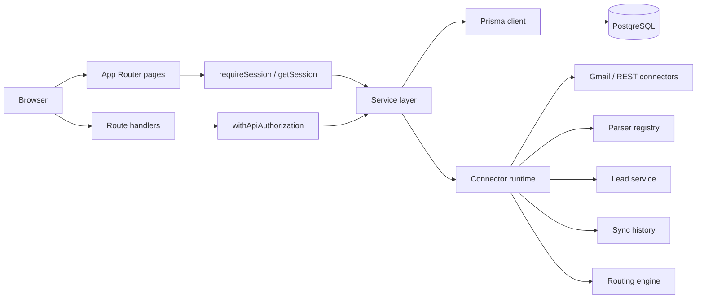
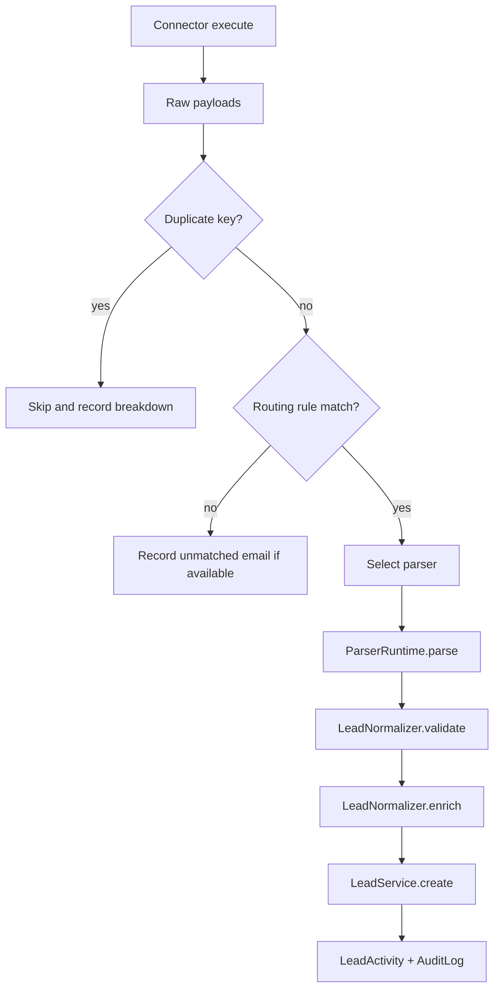

# LeadBridge Backend Architecture

## Purpose

This document describes how the current backend is organized, how requests move
through the app, and where the connector and parser execution paths fit.

## Scope

- Next.js App Router application
- One PostgreSQL database
- Better Auth for credentials and sessions
- Prisma 7 with the PostgreSQL adapter
- In-process connector execution
- Small internal CRM, not a distributed platform

## Overall architecture

```text
Browser
  -> Next.js pages / route handlers
       -> session + Zod validation
            -> service layer
                 -> Prisma 7 client + PrismaPg adapter
                      -> PostgreSQL
```



The key design rule is simple: HTTP concerns stay at the edge, business rules
stay in services, and connector-specific data stays inside the runtime pipeline.

## Layer responsibilities

| Layer | Locations | Responsibility |
| --- | --- | --- |
| Presentation | `src/app`, `src/components` | App Router pages, layouts, and feature UI. |
| Application boundary | `src/app/api`, `src/lib/session.ts`, `src/lib/api.ts`, `src/lib/validation.ts` | Authentication, authorization, request parsing, and response shaping. |
| Domain services | `src/services` | Lead, user, provider, connector, parser, note, audit, unmatched-email, parser-request, and scheduler orchestration. |
| Runtime | `src/runtime` | Connector execution, routing, normalization, retries, sync history, and runtime errors. |
| Integration contracts | `src/connectors`, `src/parsers`, `src/types` | Connector and parser contracts plus normalized shared payload shapes. |
| Infrastructure | `src/lib/prisma.ts`, `src/lib/auth.ts`, `src/lib/logger.ts`, `prisma` | Prisma client, Better Auth, logging, schema, migrations, and seed script. |

## Routing and protection

The top-level routing model is:

- `/login` for credential login
- `/admin/*` for administrator workflows
- `/sales/*` for sales workflows
- `/api/auth/[...all]` for Better Auth
- `/api/*` for application routes

`src/middleware.ts` performs only an early redirect based on cookie presence.
It is a navigation optimization, not an authorization layer.

Actual authorization happens in:

- `requireSession`
- `withApiAuthorization`

These checks reject inactive, banned, or deleted users and enforce the expected role.

## Authentication and roles

Better Auth is configured for credentials-only login and disabled public signup.
The application role model is intentionally small:

| Role | Access model |
| --- | --- |
| `ADMIN` | Admin dashboard, user management, provider management, connector control, lead deletion and restore, assignment, and queue handling. |
| `SALES` | Sales dashboard plus access to assigned leads and related notes. |

The bootstrap seed creates the first administrator and is idempotent.

## Database model

Prisma connects to PostgreSQL through `PrismaPg`.
The generated client lives in `src/generated/prisma`.

Key model groups:

- **Identity:** `User`, `Session`, `Account`, `Verification`
- **CRM core:** `Lead`, `LeadSource`, `LeadActivity`, `Note`, `Attachment`
- **Integration config:** `Connector`, `Parser`, `RoutingRule`, `FieldMapping`
- **Operational queues:** `ConnectorSyncRun`, `UnmatchedEmail`, `ParserRequest`
- **Operations:** `AuditLog`, `Setting`

Representative indexes:

- lead lookup by assigned user, status, and deletion state
- email and phone lookups for duplicate checks
- sync run history by connector and time
- audit lookup by entity and actor

The database is designed for bounded internal usage, not large-scale sharding.

## Service layer

Services are small classes exported as shared instances. They are the business
boundary, not a repository abstraction.

Important services:

- `leadService` handles create, update, assign, restore, delete, stats, and paged listing.
- `noteService` handles note list/create/update/delete with lead access checks.
- `userService` handles list, paging, assignment candidates, stats, and bootstrap metadata.
- `providerService` manages providers and routing rules.
- `connectorService` handles connector listing, Gmail discovery, test helpers, and sync run listing.
- `parserService` lists parser manifests and syncs them into the `Parser` table for admin display.
- `unmatchedEmailService` and `parserRequestService` manage the review queues.
- `schedulerService` triggers connector execution and records health.
- `auditService` writes durable audit rows and structured logs.

The rule of thumb is:

```text
route handler -> service -> Prisma
```

Do not scatter raw Prisma queries into new UI or route code when a service already exists.

## Connector and parser runtime

The connector runtime is the most important non-UI backend path.



Runtime responsibilities:

- `ConnectorRuntime` runs the connector, retries transient failures, resolves routing, and persists sync history.
- `RoutingEngine` matches incoming hints against active routing rules.
- `ParserRuntime` resolves a parser by key and executes it.
- `LeadNormalizer` validates the normalized lead and adds import metadata.
- `SyncHistory` stores the run record and updates connector status fields.
- `ExecutionLock` prevents concurrent runs of the same connector.
- `ConnectorHealthService` updates health counters and status after each run.

### Connector registration

Current registered connector factories:

- `gmail`
- `rest`

The registry is static. New connector types must be added in code.

### Parser registration

Current parser registry entries:

- `example`
- `gmail`

The parser registry is also static. `parserService.listForManagement()` mirrors
the current parser catalog into the database for the admin UI.

## API surface

Important backend routes:

- `/api/leads`
- `/api/users`
- `/api/providers`
- `/api/providers/routing-rules`
- `/api/providers/unmatched`
- `/api/providers/parser-requests`
- `/api/providers/sync-runs`
- `/api/connectors`
- `/api/connectors/[id]/settings`
- `/api/connectors/[id]/sync`
- `/api/parsers`
- `/api/parsers/preview`
- `/api/scheduler/trigger`

Operational APIs that are implemented and documented elsewhere:

- `/api/reports`
- `/api/settings`
- `/api/export`
- `/api/sync` remains a legacy compatibility route

## Validation, errors, and logging

Validation happens at the route boundary with Zod.
`safeParse` is used for external input and invalid requests return `400`.

Errors are split across layers:

- Better Auth owns auth failures.
- `ServiceError` handles service-level not-found and forbidden cases.
- Connector runtime errors cover connector, parser, validation, retryable, and configuration failures.
- Some routes still let framework errors bubble up, so the error model is not fully unified yet.

Logging is handled by Pino via `src/lib/logger.ts`.
`auditService.log()` writes both a durable row and a structured log entry.

## Operational constraints

This backend is intentionally simple:

- one deployment
- one database
- one in-process execution path
- no distributed workers
- no multi-region behavior

Treat sync runs as database-backed operations, not queue jobs.

## Related files

- [`docs/01_PROJECT_OVERVIEW.md`](./01_PROJECT_OVERVIEW.md)
- [`docs/03_DEVELOPMENT_GUIDELINES.md`](./03_DEVELOPMENT_GUIDELINES.md)
- [`docs/04_ADMINISTRATION_AND_OPERATIONS.md`](./04_ADMINISTRATION_AND_OPERATIONS.md)
- [`src/lib/session.ts`](../src/lib/session.ts)
- [`src/lib/api.ts`](../src/lib/api.ts)
- [`src/lib/prisma.ts`](../src/lib/prisma.ts)
- [`src/services/lead.service.ts`](../src/services/lead.service.ts)
- [`src/services/provider.service.ts`](../src/services/provider.service.ts)
- [`src/services/connector.service.ts`](../src/services/connector.service.ts)
- [`src/runtime/connector-runtime.ts`](../src/runtime/connector-runtime.ts)
- [`src/runtime/routing-engine.ts`](../src/runtime/routing-engine.ts)
- [`src/connectors/registry.ts`](../src/connectors/registry.ts)
- [`src/parsers/registry.ts`](../src/parsers/registry.ts)
