# LeadBridge Architecture & System Design

## Purpose

This document describes the architectural layout, system flow diagrams, data model, component boundaries, runtime pipelines, and UI design principles for LeadBridge.

## Scope

- Single-organization, single-tenant Next.js App Router architecture
- PostgreSQL database connected via Prisma 7 and the `@prisma/adapter-pg` driver adapter
- Credentials authentication and session management via Better Auth
- In-process connector execution, routing engine, and lead normalization
- Unified design system across Admin and Sales panels

---

## Overall System Architecture

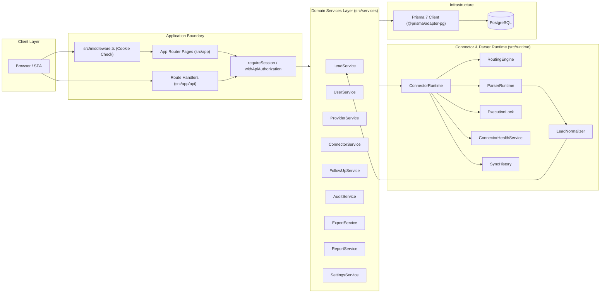
```mermaid
flowchart LR
  subgraph Client ["Client Layer"]
    Browser["Browser / SPA"]
  end

  subgraph Edge ["Application Boundary"]
    Middleware["src/middleware.ts (Cookie Check)"]
    Pages["App Router Pages (src/app)"]
    API["Route Handlers (src/app/api)"]
    AuthHelper["requireSession / withApiAuthorization"]
  end

  subgraph Services ["Domain Services Layer (src/services)"]
    LeadSvc["LeadService"]
    UserSvc["UserService"]
    ProviderSvc["ProviderService"]
    ConnectorSvc["ConnectorService"]
    FollowUpSvc["FollowUpService"]
    AuditSvc["AuditService"]
    ExportSvc["ExportService"]
    ReportSvc["ReportService"]
    SettingsSvc["SettingsService"]
  end

  subgraph Runtime ["Connector & Parser Runtime (src/runtime)"]
    ConnectorRuntime["ConnectorRuntime"]
    RoutingEngine["RoutingEngine"]
    ParserRuntime["ParserRuntime"]
    LeadNormalizer["LeadNormalizer"]
    ExecLock["ExecutionLock"]
    HealthSvc["ConnectorHealthService"]
    SyncHist["SyncHistory"]
  end

  subgraph Database ["Infrastructure"]
    Prisma["Prisma 7 Client (@prisma/adapter-pg)"]
    DB[(PostgreSQL)]
  end

  Browser --> Middleware
  Middleware --> Pages
  Browser --> API
  Pages --> AuthHelper
  API --> AuthHelper
  AuthHelper --> Services
  Services --> Prisma
  Prisma --> DB
  Services --> ConnectorRuntime
  ConnectorRuntime --> ExecLock
  ConnectorRuntime --> RoutingEngine
  ConnectorRuntime --> ParserRuntime
  ParserRuntime --> LeadNormalizer
  LeadNormalizer --> LeadSvc
  ConnectorRuntime --> SyncHist
  ConnectorRuntime --> HealthSvc
```

---

## Architecture Flow Diagrams

### 1. Request Flow

The request lifecycle ensures that HTTP concerns, authentication, and validation are handled at the edge before invoking domain services.

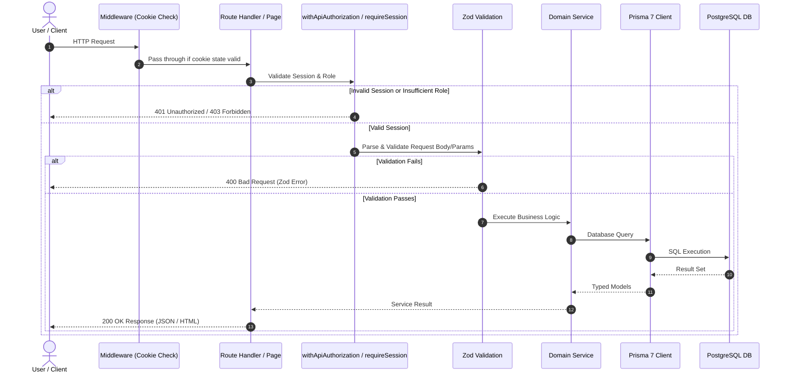
```mermaid
sequenceDiagram
    autonumber
    actor User as User / Client
    participant MW as Middleware (Cookie Check)
    participant Route as Route Handler / Page
    participant Auth as withApiAuthorization / requireSession
    participant Val as Zod Validation
    participant Service as Domain Service
    participant Prisma as Prisma 7 Client
    participant DB as PostgreSQL DB

    User->>MW: HTTP Request
    MW->>Route: Pass through if cookie state valid
    Route->>Auth: Validate Session & Role
    alt Invalid Session or Insufficient Role
        Auth-->>User: 401 Unauthorized / 403 Forbidden
    else Valid Session
        Auth->>Val: Parse & Validate Request Body/Params
        alt Validation Fails
            Val-->>User: 400 Bad Request (Zod Error)
        else Validation Passes
            Val->>Service: Execute Business Logic
            Service->>Prisma: Database Query
            Prisma->>DB: SQL Execution
            DB-->>Prisma: Result Set
            Prisma-->>Service: Typed Models
            Service-->>Route: Service Result
            Route-->>User: 200 OK Response (JSON / HTML)
        end
    end
```

### 2. REST Import Flow

Inbound REST payloads pass through pagination, array extraction, deduplication, routing, parsing, normalization, and lead creation.

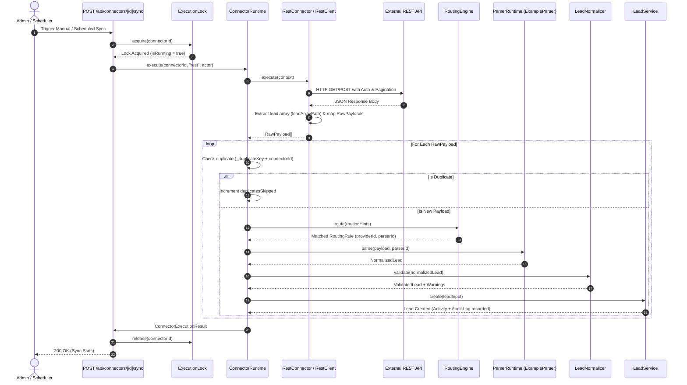
```mermaid
sequenceDiagram
    autonumber
    actor Admin as Admin / Scheduler
    participant SyncRoute as POST /api/connectors/[id]/sync
    participant ExecLock as ExecutionLock
    participant Runtime as ConnectorRuntime
    participant REST as RestConnector / RestClient
    participant ExternalAPI as External REST API
    participant Routing as RoutingEngine
    participant Parser as ParserRuntime (ExampleParser)
    participant Norm as LeadNormalizer
    participant LeadSvc as LeadService

    Admin->>SyncRoute: Trigger Manual / Scheduled Sync
    SyncRoute->>ExecLock: acquire(connectorId)
    ExecLock-->>SyncRoute: Lock Acquired (isRunning = true)
    SyncRoute->>Runtime: execute(connectorId, "rest", actor)
    Runtime->>REST: execute(context)
    REST->>ExternalAPI: HTTP GET/POST with Auth & Pagination
    ExternalAPI-->>REST: JSON Response Body
    REST->>REST: Extract lead array (leadArrayPath) & map RawPayloads
    REST-->>Runtime: RawPayload[]
    loop For Each RawPayload
        Runtime->>Runtime: Check duplicate (_duplicateKey + connectorId)
        alt Is Duplicate
            Runtime->>Runtime: Increment duplicatesSkipped
        else Is New Payload
            Runtime->>Routing: route(routingHints)
            Routing-->>Runtime: Matched RoutingRule (providerId, parserId)
            Runtime->>Parser: parse(payload, parserId)
            Parser-->>Runtime: NormalizedLead
            Runtime->>Norm: validate(normalizedLead)
            Norm-->>Runtime: ValidatedLead + Warnings
            Runtime->>LeadSvc: create(leadInput)
            LeadSvc-->>Runtime: Lead Created (Activity + Audit Log recorded)
        end
    end
    Runtime->>SyncRoute: ConnectorExecutionResult
    SyncRoute->>ExecLock: release(connectorId)
    SyncRoute-->>Admin: 200 OK (Sync Stats)
```

### 3. Connector Lifecycle

Connectors transition through initial configuration, schedule updates, execution lock acquisition, runtime execution, health recording, and sync history logging.

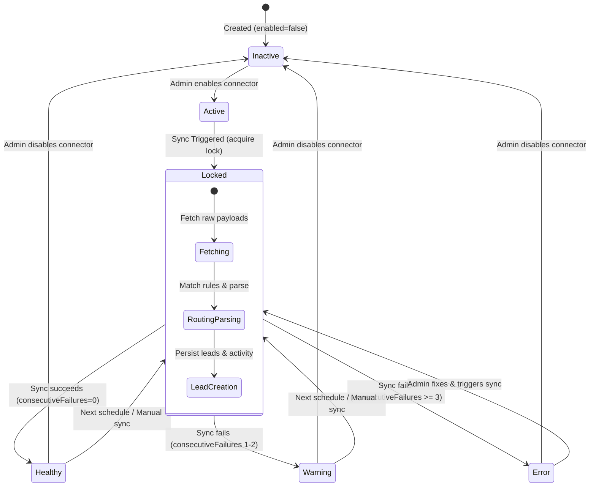
```mermaid
stateDiagram-v2
    [*] --> Inactive: Created (enabled=false)
    Inactive --> Active: Admin enables connector
    Active --> Locked: Sync Triggered (acquire lock)
    
    state Locked {
        [*] --> Fetching: Fetch raw payloads
        Fetching --> RoutingParsing: Match rules & parse
        RoutingParsing --> LeadCreation: Persist leads & activity
    }

    Locked --> Healthy: Sync succeeds (consecutiveFailures=0)
    Locked --> Warning: Sync fails (consecutiveFailures 1-2)
    Locked --> Error: Sync fails (consecutiveFailures >= 3)
    
    Healthy --> Locked: Next schedule / Manual sync
    Warning --> Locked: Next schedule / Manual sync
    Error --> Locked: Admin fixes & triggers sync
    
    Healthy --> Inactive: Admin disables connector
    Warning --> Inactive: Admin disables connector
    Error --> Inactive: Admin disables connector
```

### 4. Lead Processing Pipeline

Detailed flow showing raw lead transformation from raw source payload to fully enriched CRM record.

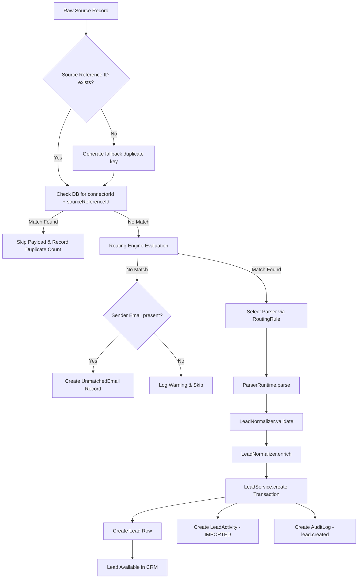
```mermaid
flowchart TD
    A[Raw Source Record] --> B{Source Reference ID exists?}
    B -->|Yes| C[Check DB for connectorId + sourceReferenceId]
    B -->|No| D[Generate fallback duplicate key]
    D --> C
    C -->|Match Found| E[Skip Payload & Record Duplicate Count]
    C -->|No Match| F[Routing Engine Evaluation]
    F -->|No Match| G{Sender Email present?}
    G -->|Yes| H[Create UnmatchedEmail Record]
    G -->|No| I[Log Warning & Skip]
    F -->|Match Found| J[Select Parser via RoutingRule]
    J --> K[ParserRuntime.parse]
    K --> L[LeadNormalizer.validate]
    L --> M[LeadNormalizer.enrich]
    M --> N[LeadService.create Transaction]
    N --> O[Create Lead Row]
    N --> P[Create LeadActivity - IMPORTED]
    N --> Q[Create AuditLog - lead.created]
    O --> R[Lead Available in CRM]
```

### 5. Parser Flow

Parsers convert vendor-specific or channel-specific payload structures into normalized lead shapes.

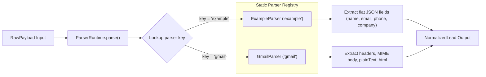
```mermaid
flowchart LR
    subgraph ParserRegistry ["Static Parser Registry"]
        Example["ExampleParser ('example')"]
        Gmail["GmailParser ('gmail')"]
    end

    RawInput["RawPayload Input"] --> ParserRuntime["ParserRuntime.parse()"]
    ParserRuntime --> RegistryLookup{Lookup parser key}
    RegistryLookup -->|key = 'example'| Example
    RegistryLookup -->|key = 'gmail'| Gmail
    
    Example --> Extractor1["Extract flat JSON fields (name, email, phone, company)"]
    Gmail --> Extractor2["Extract headers, MIME body, plainText, html"]
    
    Extractor1 --> NormLead["NormalizedLead Output"]
    Extractor2 --> NormLead
```

### 6. Routing Flow

The routing engine evaluates incoming payloads against active rules sorted by priority.

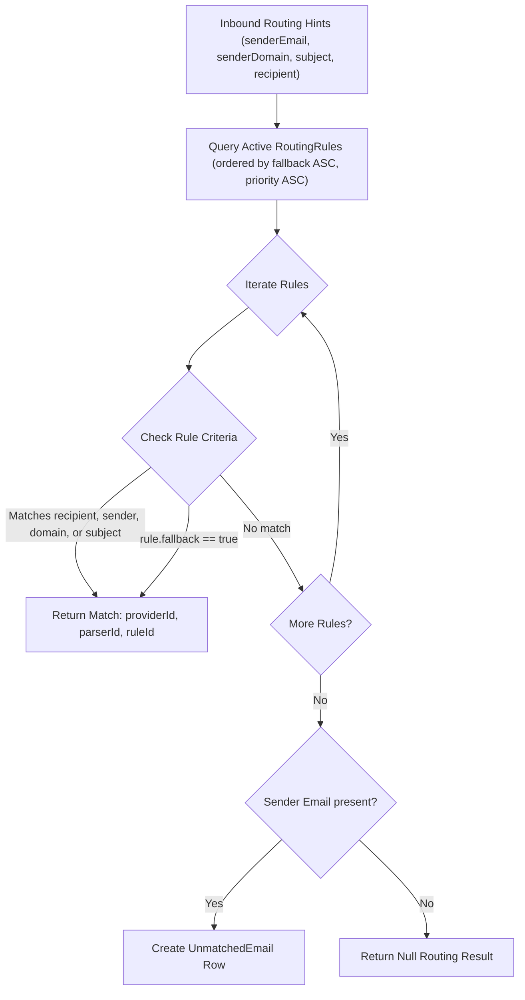
```mermaid
flowchart TD
    InboundHints["Inbound Routing Hints (senderEmail, senderDomain, subject, recipient)"] --> QueryRules["Query Active RoutingRules (ordered by fallback ASC, priority ASC)"]
    QueryRules --> RuleLoop{Iterate Rules}
    
    RuleLoop --> MatchCheck{Check Rule Criteria}
    MatchCheck -->|Matches recipient, sender, domain, or subject| MatchFound[Return Match: providerId, parserId, ruleId]
    MatchCheck -->|rule.fallback == true| MatchFound
    MatchCheck -->|No match| NextRule{More Rules?}
    
    NextRule -->|Yes| RuleLoop
    NextRule -->|No| CheckEmail{Sender Email present?}
    
    CheckEmail -->|Yes| QueueUnmatched[Create UnmatchedEmail Row]
    CheckEmail -->|No| Unrouted[Return Null Routing Result]
```

### 7. Admin Operations Flow

Administrative actions flow through dedicated route handlers, performing authorized operations with structured audit logging.

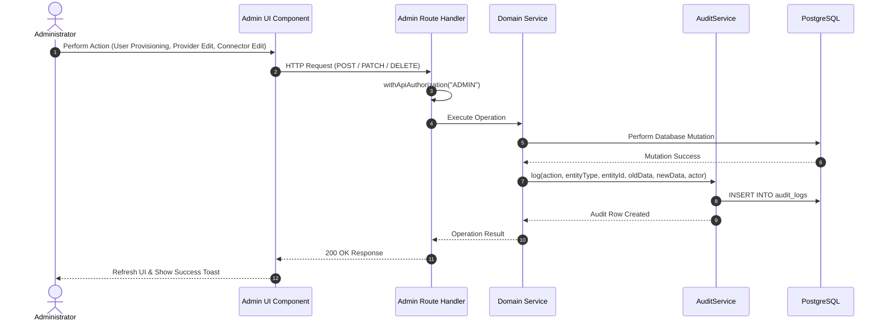
```mermaid
sequenceDiagram
    autonumber
    actor Admin as Administrator
    participant UI as Admin UI Component
    participant API as Admin Route Handler
    participant Service as Domain Service
    participant Audit as AuditService
    participant DB as PostgreSQL

    Admin->>UI: Perform Action (User Provisioning, Provider Edit, Connector Edit)
    UI->>API: HTTP Request (POST / PATCH / DELETE)
    API->>API: withApiAuthorization("ADMIN")
    API->>Service: Execute Operation
    Service->>DB: Perform Database Mutation
    DB-->>Service: Mutation Success
    Service->>Audit: log(action, entityType, entityId, oldData, newData, actor)
    Audit->>DB: INSERT INTO audit_logs
    Audit-->>Service: Audit Row Created
    Service-->>API: Operation Result
    API-->>UI: 200 OK Response
    UI-->>Admin: Refresh UI & Show Success Toast
```

### 8. Dashboard Data Flow

Dashboard metrics are aggregated directly from the database based on the caller's session role.

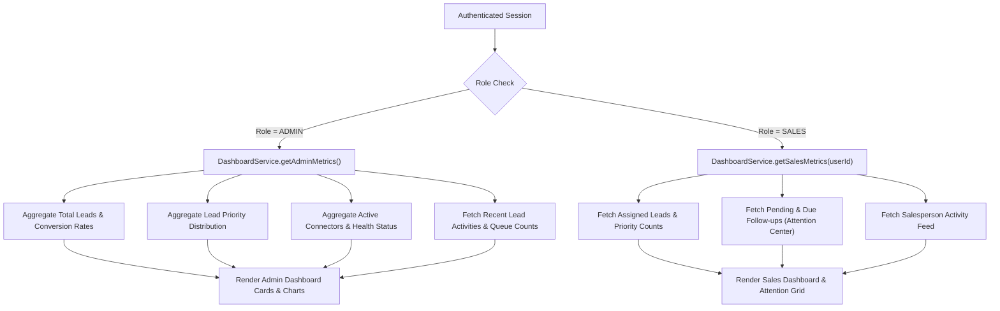
```mermaid
flowchart TD
    Session["Authenticated Session"] --> RoleCheck{Role Check}
    
    RoleCheck -->|Role = ADMIN| AdminDash["DashboardService.getAdminMetrics()"]
    RoleCheck -->|Role = SALES| SalesDash["DashboardService.getSalesMetrics(userId)"]
    
    AdminDash --> Ag1["Aggregate Total Leads & Conversion Rates"]
    AdminDash --> Ag2["Aggregate Lead Priority Distribution"]
    AdminDash --> Ag3["Aggregate Active Connectors & Health Status"]
    AdminDash --> Ag4["Fetch Recent Lead Activities & Queue Counts"]
    
    SalesDash --> S1["Fetch Assigned Leads & Priority Counts"]
    SalesDash --> S2["Fetch Pending & Due Follow-ups (Attention Center)"]
    SalesDash --> S3["Fetch Salesperson Activity Feed"]
    
    Ag1 & Ag2 & Ag3 & Ag4 --> AdminResponse["Render Admin Dashboard Cards & Charts"]
    S1 & S2 & S3 --> SalesResponse["Render Sales Dashboard & Attention Grid"]
```

### 9. Export Flow

The export system streams CSV reports directly from domain database queries.

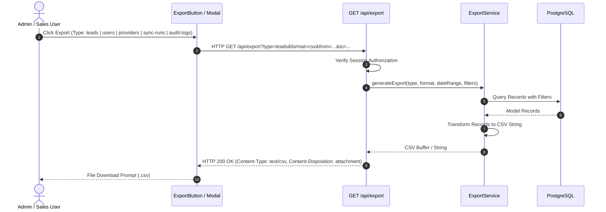
```mermaid
sequenceDiagram
    autonumber
    actor User as Admin / Sales User
    participant ExportUI as ExportButton / Modal
    participant API as GET /api/export
    participant ExportSvc as ExportService
    participant DB as PostgreSQL

    User->>ExportUI: Click Export (Type: leads | users | providers | sync-runs | audit-logs)
    ExportUI->>API: HTTP GET /api/export?type=leads&format=csv&from=...&to=...
    API->>API: Verify Session Authorization
    API->>ExportSvc: generateExport(type, format, dateRange, filters)
    ExportSvc->>DB: Query Records with Filters
    DB-->>ExportSvc: Model Records
    ExportSvc->>ExportSvc: Transform Records to CSV String
    ExportSvc-->>API: CSV Buffer / String
    API-->>ExportUI: HTTP 200 OK (Content-Type: text/csv, Content-Disposition: attachment)
    ExportUI-->>User: File Download Prompt (.csv)
```

### 10. Audit Logging Flow

Every mutating administrative and domain event produces structured log outputs and durable audit records.

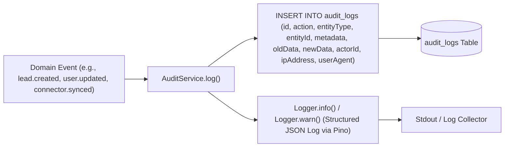
```mermaid
flowchart LR
    DomainEvent["Domain Event (e.g., lead.created, user.updated, connector.synced)"] --> AuditSvc["AuditService.log()"]
    
    AuditSvc --> WriteDB["INSERT INTO audit_logs (id, action, entityType, entityId, metadata, oldData, newData, actorId, ipAddress, userAgent)"]
    AuditSvc --> WritePino["Logger.info() / Logger.warn() (Structured JSON Log via Pino)"]
    
    WriteDB --> AuditTable[(audit_logs Table)]
    WritePino --> Stdout[Stdout / Log Collector]
```

---

## Layer Responsibilities

| Layer | Path | Responsibility |
| --- | --- | --- |
| **Presentation (Pages)** | `src/app/(dashboard)/admin`, `src/app/(dashboard)/sales`, `src/app/login` | Next.js Server Components, layouts, and page routes. |
| **Presentation (Components)** | `src/components/admin`, `src/components/sales`, `src/components/shared`, `src/components/ui`, `src/components/audit`, `src/components/connectors`, `src/components/leads`, `src/components/providers`, `src/components/users` | UI component tree organized by feature domain and reuse tier. |
| **Application Boundary** | `src/app/api`, `src/lib/session.ts`, `src/lib/api.ts`, `src/lib/validation.ts` | Route handlers, session extraction, authorization guards, request schema validation. |
| **Domain Services** | `src/services/*.service.ts` (22 services) | Business logic orchestration, Prisma queries, transaction boundaries, activity and audit recording. |
| **Integration Runtime** | `src/runtime` | Connector execution, routing rule matching, parser execution, normalization, execution locks, retry policies, sync history. |
| **Integration Contracts** | `src/connectors`, `src/parsers`, `src/types` | Vendor connector implementations, parser base classes, registry definitions, domain data contracts. |
| **Infrastructure** | `src/lib/prisma.ts`, `src/lib/auth.ts`, `src/lib/logger.ts`, `prisma` | Prisma 7 client initialization, Better Auth configuration, Pino logger, schema migrations, and seed scripts. |

---

## Database Model Architecture

The PostgreSQL database schema is defined in `prisma/schema.prisma` and generated into `src/generated/prisma`.

### Entity Map & Schema Summary

```text
Identity Group:
  User ──< Session
  User ──< Account
  Verification

Core CRM Group:
  LeadSource (Provider) ──< Lead
  LeadSource ──< Connector
  LeadSource ──< RoutingRule
  LeadSource ──< UnmatchedEmail
  Lead ──< LeadActivity
  Lead ──< Note ──< FollowUp
  Lead ──< FollowUp
  Lead ──< Attachment
  User ──< AssignedLeads (Lead)

Integrations & Config Group:
  Connector ──< ConnectorSyncRun
  Connector ──< FieldMapping
  Parser ──< Connector
  Parser ──< RoutingRule

Operational Queues & Ops:
  UnmatchedEmail ──< ParserRequest
  User ──< AuditLog
  User ──< Setting
```

### Table Definitions

1. **`users` (`User`)**: Internal team accounts (`ADMIN`, `SALES`). Tracks active state, ban status, employee codes, sales privilege level (`JUNIOR`, `SENIOR`), and creation hierarchy.
2. **`sessions` (`Session`)**: Better Auth active user sessions.
3. **`accounts` (`Account`)**: Better Auth credential store and authentication provider keys.
4. **`verifications` (`Verification`)**: Auth verification tokens.
5. **`LeadSource`**: Represents a vendor lead provider (e.g. "IndiaMART", "TradeIndia", "Website REST"). Corresponds to "Provider" in the admin UI.
6. **`Lead`**: Core lead record containing contact details, company, financial fields (budget, expected value, currency), UTM parameters, lead status (`NEW`, `CONVERTED`, `LOST`, `SPAM`, `ON_HOLD`), priority (`LOW`, `MEDIUM`, `HIGH`, `URGENT`), category, assignment, and soft deletion state (`isDeleted`, `deletedAt`).
7. **`LeadActivity`**: Immutable activity log for lead timeline (`CREATED`, `UPDATED`, `ASSIGNED`, `NOTE_ADDED`, `IMPORTED`, `STATUS_CHANGED`, `FOLLOW_UP`, `DELETED`, `RESTORED`).
8. **`Note`**: Interaction notes attached to leads with author references, pinned status, and structured fields ("what I did" / "what customer said").
9. **`FollowUp`**: Scheduled follow-up tasks linked to leads and notes, with due dates, times, priority, assignee, creator, and completion state.
10. **`Attachment`**: File metadata attached to leads with storage keys and checksums.
11. **`Connector`**: External integration config storing type (`gmail`, `rest`), schedule type (`MANUAL`, `EVERY_5_MIN`, `HOURLY`, etc.), status, health status, failure metrics, execution lock state (`isRunning`, `lockedAt`, `lockedBy`), and non-secret JSON configuration.
12. **`Parser`**: Catalog of registered parsers storing parser type, key, version, and configuration.
13. **`ConnectorSyncRun`**: Execution history for connector sync runs recording started/completed timestamps, records seen/created/updated/skipped, error messages, and breakdown JSON.
14. **`RoutingRule`**: Priority-ordered routing rules mapping recipient Gmail accounts, sender emails, sender domains, subject patterns, or catch-all fallbacks to a specific Provider and Parser.
15. **`UnmatchedEmail`**: Operational queue storing inbound emails that failed routing rule matches.
16. **`ParserRequest`**: Vendor sample review queue tracking vendor leads requiring custom parser development.
17. **`FieldMapping`**: Custom source-to-target field mappings associated with connectors.
18. **`AuditLog`**: System audit log recording action name, entity type, entity ID, actor reference, IP address, user agent, old JSON data, and new JSON data.
19. **`Setting`**: Categorized system settings store storing key-value JSON configurations.

---

## Authentication and Roles

Better Auth is configured strictly for internal credential authentication with public signup disabled.

### Role Hierarchy

- **`ADMIN`**: Complete system access. Manages users, providers, routing rules, connectors, sync triggers, execution locks, review queues, reports, settings, audit logs, lead deletion, assignment, and CSV exports.
- **`SALES`**: Sales operations access. Works assigned leads, creates and edits notes, schedules and completes follow-ups, updates lead status/priority, views personal dashboard, and exports assigned leads.
  - **`SalesPrivilege.JUNIOR`**: Standard salesperson access to assigned leads.
  - **`SalesPrivilege.SENIOR`**: Senior salesperson with expanded lead visibility within sales workflows.

---

## UI Architecture & Design System

### Navigation Architecture

The application uses a multi-tier navigation pattern implemented in `src/components/shared/navigation/`:

- **Top Navbar (`src/components/shared/navbar.tsx`)**: Header containing logo, section title, global search/filter triggers, resync button, user avatar, and sign-out menu.
- **Bottom Navigation Bar (`BottomNavigation.tsx`)**: Fixed bottom navigation bar on mobile and desktop viewports, displaying primary role items:
  - **Admin Navigation**: Dashboard (`/admin`), Leads (`/admin/leads`), Reports (`/admin/reports`), and a "More" drawer trigger.
  - **Sales Navigation**: Dashboard (`/sales`), My Leads (`/sales/my-leads`), Attention Center (`/sales/tasks`), and Profile (`/sales/profile`).
- **"More" Drawer Menu (`BottomNavigationMenu.tsx`)**: Popover/slide-up menu rendering secondary administrative links: Connectors (`/admin/connectors`), User Administration (`/admin/users`), Providers (`/admin/providers`), Audit Logs (`/admin/audit-logs`), and Settings (`/admin/settings`).

### Design Tokens & Surface Hierarchy

The design system is built using CSS custom properties in `src/app/globals.css`:

```css
:root {
  --color-surface: #f8fafc;
  --color-panel: #ffffff;
  --color-border: #e2e8f0;
  --color-ink: #0f172a;
  --color-muted: #64748b;
  --color-brand: #2563eb;
}
```

1. **Layer 1 (Canvas)**: Background canvas (`var(--color-surface)`).
2. **Layer 2 (Cards & Panels)**: Elevated containers (`var(--color-panel)`) with subtle borders (`var(--color-border)`) and light shadows (`shadow-xs`).
3. **Layer 3 (Content Elements)**: Text, badges, tables, and form inputs inside cards.
4. **Blueprint Canvas (`BlueprintBackground`)**: Optional technical background grid with radial mask fading used for standalone utility pages (login, empty states, 404).

---

## Complete API Surface

| Endpoint | Method | Authorization | Purpose |
| --- | --- | --- | --- |
| `/api/auth/[...all]` | ALL | Public | Better Auth authentication handlers |
| `/api/dashboard` | GET | ADMIN, SALES | Role-derived dashboard metrics |
| `/api/leads` | GET | ADMIN, SALES | List leads with pagination, search, filters |
| `/api/leads` | POST | ADMIN, SALES | Manually create lead |
| `/api/leads/[id]` | GET | ADMIN, SALES | Get lead details |
| `/api/leads/[id]` | PATCH | ADMIN, SALES | Update lead fields |
| `/api/leads/[id]` | DELETE | DELETE_LEAD Permission | Soft-delete lead |
| `/api/leads/[id]/assign` | POST | ADMIN | Assign lead to sales user |
| `/api/leads/[id]/activities` | GET | ADMIN, SALES | Get lead activity timeline |
| `/api/leads/[id]/notes` | GET | ADMIN, SALES | List lead notes |
| `/api/leads/[id]/notes` | POST | ADMIN, SALES | Add note to lead |
| `/api/leads/[id]/follow-ups` | GET | ADMIN, SALES | List lead follow-ups |
| `/api/leads/[id]/follow-ups` | POST | ADMIN, SALES | Create follow-up for lead |
| `/api/follow-ups/[id]` | PATCH | ADMIN, SALES | Update follow-up status/priority |
| `/api/follow-ups/[id]` | DELETE | ADMIN, SALES | Delete follow-up task |
| `/api/notes/[id]` | PATCH | ADMIN, SALES | Update note content / pinned state |
| `/api/notes/[id]` | DELETE | ADMIN, SALES | Delete note |
| `/api/users` | GET | ADMIN | List users with pagination and search |
| `/api/users` | POST | ADMIN | Provision new user |
| `/api/users/[id]` | PATCH | ADMIN | Update user role, status, or details |
| `/api/providers` | GET | ADMIN | List providers with connector & routing info |
| `/api/providers` | POST | ADMIN | Create new provider |
| `/api/providers/[id]` | PATCH | ADMIN | Update provider details |
| `/api/providers/[id]` | DELETE | ADMIN | Delete provider |
| `/api/providers/routing-rules` | GET | ADMIN | List routing rules |
| `/api/providers/routing-rules` | POST | ADMIN | Create routing rule |
| `/api/providers/connectors/test` | POST | ADMIN | Test Gmail or REST connector connection |
| `/api/providers/gmail` | GET | ADMIN | List discovered environment Gmail accounts |
| `/api/providers/unmatched` | GET | ADMIN | List unmatched email queue |
| `/api/providers/unmatched` | PATCH | ADMIN | Process unmatched email item |
| `/api/providers/parser-requests` | GET | ADMIN | List parser requests queue |
| `/api/providers/parser-requests` | PATCH | ADMIN | Update parser request status |
| `/api/providers/parsers` | GET | ADMIN | List parser catalog for management |
| `/api/providers/sync-runs` | GET | ADMIN | List connector sync run history |
| `/api/connectors` | GET | ADMIN | List supported connector types |
| `/api/connectors` | POST | ADMIN | Create new connector |
| `/api/connectors/[id]` | DELETE | ADMIN | Delete connector |
| `/api/connectors/[id]/settings` | PATCH | ADMIN | Update connector enabled/schedule/health |
| `/api/connectors/[id]/sync` | POST | ADMIN | Trigger manual connector sync |
| `/api/parsers` | GET | ADMIN | List registered parser manifests |
| `/api/parsers/preview` | POST | ADMIN | Preview parser parsing on sample payload |
| `/api/scheduler/trigger` | POST | ADMIN | Trigger due connectors or specific connector |
| `/api/reports` | GET | ADMIN | Generate summary, source, activity, status reports |
| `/api/settings` | GET | ADMIN | Get system settings |
| `/api/settings` | PATCH | ADMIN | Update system settings |
| `/api/audit-logs` | GET | ADMIN | Search audit logs with filters |
| `/api/export` | GET | ADMIN, SALES | Download CSV export (leads, users, etc.) |
| `/api/resync` | POST | ADMIN, SALES | Re-sync state helper |

---

## Related Documents

- [01_PROJECT_OVERVIEW.md](./01_PROJECT_OVERVIEW.md)
- [03_DEVELOPMENT_GUIDELINES.md](./03_DEVELOPMENT_GUIDELINES.md)
- [04_ADMINISTRATION_AND_OPERATIONS.md](./04_ADMINISTRATION_AND_OPERATIONS.md)
- [05_ARCHITECTURE_AUDIT.md](./05_ARCHITECTURE_AUDIT.md)
- [06_REST_CONNECTOR_IMPLEMENTATION_REPORT.md](./06_REST_CONNECTOR_IMPLEMENTATION_REPORT.md)
