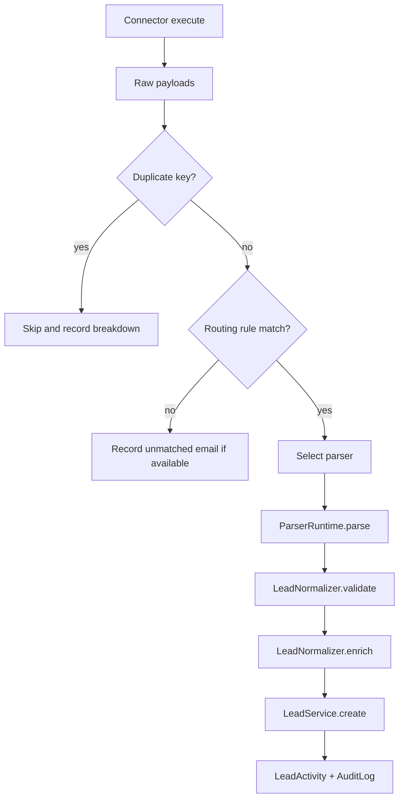

# Connector & Parser Developer Guide

## Purpose

This guide explains how to add or modify integrations without reading the entire
repository.

It covers:

- connector contract and registry behavior
- parser contract and registry behavior
- runtime execution and error handling
- testing and validation expectations

## Scope

- Backend integration code only
- Static connector and parser registration
- In-process execution, not queue workers
- Small internal CRM usage

## Non-negotiable principles

1. Extend the existing architecture; do not rewrite working foundations for stylistic preference.
2. Keep connector behavior isolated from lead persistence and UI code.
3. Keep parser code deterministic and side-effect free.
4. Enforce security on the server. Client state and middleware are not authorization.
5. Preserve the internal-only account model: public signup must remain disabled.

## Project, naming, and folder conventions

| Concern | Convention |
| --- | --- |
| Files | kebab-case: `lead-delete-button.tsx`, `connector.service.ts`. |
| React components/classes | PascalCase: `LeadForm`, `LeadService`. |
| Functions/variables | camelCase. |
| Domain types | PascalCase; use `type` for shared data shapes unless interface extension is useful. |
| Services | Place in `src/services/<domain>.service.ts`; export one named class and one shared instance. |
| Route handlers | Place under `src/app/api/.../route.ts`; follow App Router HTTP method exports. |
| Pages/layouts | Use App Router conventions in `src/app`; use route groups for organization only. |
| UI primitives | Keep generic, reusable controls in `src/components/ui`; place domain-specific compositions beside other components. |
| Integrations | Connector contracts/implementations in `src/connectors`; parser implementations/registry entries in `src/parsers`; runtime flow in `src/runtime`. |

Use the `@/` alias for imports rooted at `src`. Do not edit `src/generated/prisma`; regenerate it with `pnpm prisma generate` after schema changes.

## Connector model

The connector contract is defined in [`src/runtime/runtime-types.ts`](../src/runtime/runtime-types.ts).
The registry is in [`src/connectors/registry.ts`](../src/connectors/registry.ts).

Current connector interface:

```ts
interface IConnector {
  readonly key: string;
  execute(context: ExecutionContext): Promise<RawPayload[]>;
}
```

Where the runtime expects the connector to behave:

- Return raw, source-shaped payloads.
- Include routing hints in `_routing` when possible.
- Include a `_duplicateKey` when the source has a stable external ID.
- Throw meaningful errors when the source is misconfigured or unreachable.

### Current connector implementations

- `GmailConnector` in `src/connectors/gmail/gmail-connector.ts`
- `RestConnector` in `src/connectors/rest/rest-connector.ts`

Both are registered statically in `src/connectors/registry.ts`.

### Adding a connector

1. Implement `IConnector`.
2. Register the factory in `src/connectors/registry.ts`.
3. Validate configuration before making network calls.
4. Return raw payloads only; do not write Prisma data from the connector.
5. Let the runtime handle routing, parsing, normalization, and persistence.
6. Add a connection test path if admins need to validate configuration before syncing.
7. Document required environment variables or connector config fields.

### Connector configuration rules

- Gmail uses environment variables, not database-stored secrets.
- REST connectors store non-secret configuration in `Connector.configuration`.
- Do not store raw tokens in client-visible state.
- Keep the `type` value aligned with the registered factory key.

### Connector runtime lifecycle

The execution path is:

```text
Connector -> ConnectorRuntime -> RoutingEngine -> ParserRuntime -> LeadNormalizer -> LeadService
```

Execution helpers:

- `ConnectorRuntime` runs the connector, retries transient failures, resolves routing, and persists sync history.
- `ExecutionLock` prevents concurrent runs of the same connector.
- `ConnectorHealthService` updates health state and failure counters.
- `RetryPolicy` retries only when the error is considered retryable.

Common runtime outputs:

- `success`
- `failed`
- `skipped`
- `retry`
- `cancelled`

## Parser model

The parser base class is in [`src/parsers/base-parser.ts`](../src/parsers/base-parser.ts).
The registry is in [`src/parsers/registry.ts`](../src/parsers/registry.ts).

Current parser interface:

```ts
abstract class BaseParser<T = unknown> {
  abstract key: string;
  abstract parse(input: T): NormalizedLead;
}
```

### Current parsers

- `example`
- `gmail`

`MockParser` exists as a dev helper under `src/runtime/mock`, but it is not registered in the main parser registry.

`parserService.listForManagement()` upserts the registered parser manifests into the `Parser` table so the admin UI can display them.

### Adding a parser

1. Extend `BaseParser<T>`.
2. Give it a stable `key`.
3. Return a `NormalizedLead` and nothing else.
4. Register it in `parserRegistry`.
5. Keep it deterministic.
6. Add a manifest that accurately describes supported provider types and attachments.
7. Add a preview or fixture if operators need to validate sample payloads.

### Parser manifests

The manifest is what the admin UI consumes. It should stay honest:

- `key`
- `name`
- `version`
- `description`
- `providerTypesSupported`
- `developerNotes`
- `supportsAttachments`
- `enabled`

## Runtime flow

The connector runtime does not trust raw connector payloads.



Implementation details that matter:

- Routing is priority-based and the first match wins.
- No parser match means the payload is skipped.
- Duplicate detection is source-reference aware when `_duplicateKey` is available.
- Normalization adds warnings but does not block imports by itself.
- Lead creation writes activity and audit rows.

## Error handling

Use the runtime error classes in `src/runtime/runtime-errors.ts` when a failure
needs to be classified.

| Error class | Meaning |
| --- | --- |
| `ConfigurationError` | Missing or invalid connector/parser configuration. |
| `ConnectorError` | Source-side failure that is not necessarily retryable. |
| `ParserError` | Parsing failed for a payload. |
| `ValidationError` | Payload or normalized lead failed validation. |
| `RetryableError` | A transient failure that should be retried. |

The current retry policy retries network-like and rate-limit errors. Do not
swallow failures silently. If the connector cannot proceed, surface a meaningful
error and let the runtime persist the failed run.

## Testing

Use the API endpoints that already exist for validation:

- `POST /api/providers/connectors/test` checks Gmail or REST configuration.
- `POST /api/parsers/preview` runs a parser against a sample payload.
- `POST /api/connectors/[id]/sync` exercises the end-to-end runtime.

Suggested test cases:

- valid payload
- payload missing expected keys
- malformed email or phone values
- routing miss
- duplicate payload
- transient connector failure
- invalid connector configuration

## Common mistakes

- Returning raw vendor data from a parser.
- Reading Prisma directly from connector code.
- Registering a parser but not exposing a manifest that matches its behavior.
- Assuming the mock runtime is production wiring. It is not.
- Using a parser to fetch data or manage retries.
- Storing secrets in database configuration where they should remain in env vars.

## Workflow reminders

- Run `pnpm typecheck` after connector or parser changes.
- Run the relevant API preview or connection-test routes.
- Add focused fixtures when a payload shape is source-specific.
- Keep any new runtime helper narrow and testable.

## Related files

- [`src/connectors/types.ts`](../src/connectors/types.ts)
- [`src/connectors/registry.ts`](../src/connectors/registry.ts)
- [`src/connectors/gmail/gmail-connector.ts`](../src/connectors/gmail/gmail-connector.ts)
- [`src/connectors/rest/rest-connector.ts`](../src/connectors/rest/rest-connector.ts)
- [`src/parsers/base-parser.ts`](../src/parsers/base-parser.ts)
- [`src/parsers/registry.ts`](../src/parsers/registry.ts)
- [`src/parsers/example-parser.ts`](../src/parsers/example-parser.ts)
- [`src/connectors/gmail/gmail-parser.ts`](../src/connectors/gmail/gmail-parser.ts)
- [`src/runtime/connector-runtime.ts`](../src/runtime/connector-runtime.ts)
- [`src/runtime/parser-runtime.ts`](../src/runtime/parser-runtime.ts)
- [`src/runtime/lead-normalizer.ts`](../src/runtime/lead-normalizer.ts)
- [`src/runtime/retry-policy.ts`](../src/runtime/retry-policy.ts)
- [`src/runtime/routing-engine.ts`](../src/runtime/routing-engine.ts)
